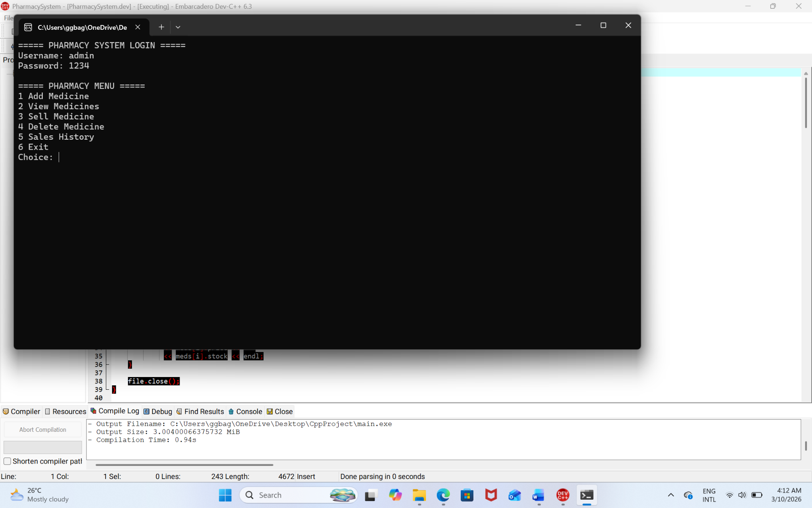

# Pharmacy Management System
## System Preview

A C++ console-based Pharmacy Management System with POS and inventory tracking.

## Features

- Add new medicines
- View available medicines
- Sell medicines (POS)
- Update stock automatically
- Save medicines to file
- Record sales transactions

## Technologies Used

- C++
- File Handling
- Arrays and Structures

## Files

main.cpp - Main program source code  
medicines.txt - Medicine inventory database  
sales.txt - Sales transaction records

## How to Run

1. Compile the program using a C++ compiler
2. Run the executable file
3. Use the menu to manage medicines and sales

## Author

Developed by Geneva
